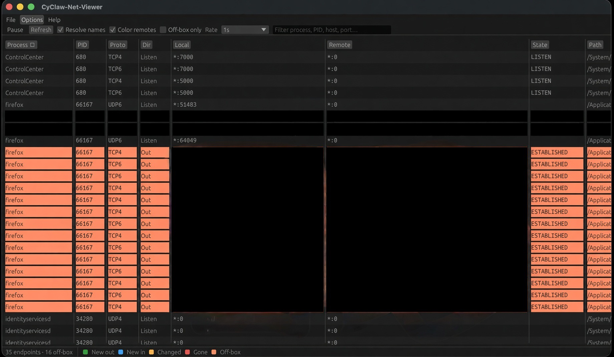

# MacOS / CyClaw-Net-Viewer

[](https://github.com/cgfixit/Mac-NetViewer-EZview/actions/workflows/ci.yml)
[](LICENSE)
[](rust-toolchain.toml)
[](docs/BUILD.md)

Live TCP/UDP endpoint table for macOS. Process, PID, protocol, direction, local and remote addresses, TCP state. Inspired by Sysinternals TCPView. Not affiliated with Microsoft.

App Screenshot:



## What it does

- Lists TCP and UDP sockets this Mac will admit through libproc, including IPv4 and IPv6.
- Refreshes on a timer (default 1s). New outgoing rows are green. New incoming or listen rows are blue. State changes are yellow. Closed rows linger red on the first two refreshes where they are absent, then disappear on the third. Off-box remotes stay orange while they exist.
- Resolves names in the background. Cells prefer `hostname (IPv4):port` when PTR and A records exist. IPv6 sockets stay in the table.
- Builds a double-click `.app` and a Tcpvcon-style CLI in the same binary.

UDP direction is **Unknown**: the socket library exposes local bindings but
omits remote peers, including for connected UDP. Unknown rows get no new-in/out
flash and remain visible when **Show listeners** is off. TCP direction is a
listening-port heuristic; see [Direction](docs/DESIGN.md#direction).

## What it does not

- ICMP / ping. Those are not TCP or UDP sockets.
- Firewall or packet capture.
- Windows-style TCB delete. **Close Connection** confirms `SIGTERM` of the owning process.

## Colors

| Color | Meaning |
| --- | --- |
| Green | New outgoing endpoint |
| Blue | New incoming endpoint or new LISTEN |
| Yellow | Same 4-tuple, TCP state changed |
| Red | Endpoint gone (two refresh ticks, then drop) |
| Orange | Stable TCP/UDP to an off-box peer (not loopback, not `*`) |

Turn on **Off-box only** when watching CyClaw telemetry-kill. Event colors still win over orange.

## Get the app

Download the artifact from a successful [Bundle workflow](https://github.com/cgfixit/Mac-NetViewer-EZview/actions/workflows/bundle.yml)
run on `master` for the revision you want. GitHub sign-in is required for
Actions downloads, which expire after 14 days; build from source if none
is available. PR artifacts contain proposed changes and are for review.
No Rust is required to run a downloaded app.

Extract the Actions download first, then verify and unpack the inner ZIP
on macOS:

```bash
shasum -a 256 -c CyClaw-Net-Viewer.zip.sha256
ditto -x -k CyClaw-Net-Viewer.zip .
codesign --verify --deep --strict CyClaw-Net-Viewer.app
open CyClaw-Net-Viewer.app
```

The binary is ad-hoc signed, not notarized. Gatekeeper may require an
explicit per-app approval; follow the options provided by your macOS
version. Do not disable Gatekeeper system-wide. Ad-hoc signatures and
checksums do not identify a trusted publisher. Do not App-Sandbox the
bundle: that hides other processes' sockets.

Requires macOS 12 or newer, Intel or Apple Silicon. CI verifies universal
`arm64` + `x86_64` builds. Local builds can fall back to the host architecture.
Generated apps are no longer checked into Git, so old binaries cannot
silently accompany new source fixes.

## Build from source

Rust **1.85.0** is pinned (`rust-toolchain.toml`). Homebrew rustc is newer and is not the pin.

```bash
export PATH="$HOME/.cargo/bin:$PATH"
git clone https://github.com/cgfixit/Mac-NetViewer-EZview.git
cd Mac-NetViewer-EZview
rustup toolchain install 1.85.0
./scripts/check.sh
cargo run --locked
cargo run --locked -- --cli -n -a
./scripts/make-app.sh          # dist/CyClaw-Net-Viewer.app
./scripts/make-app.sh --dmg    # dist/CyClaw-Net-Viewer.dmg
```

See [docs/BUILD.md](docs/BUILD.md).

## Privacy and exports

Name resolution is enabled by default and uses the system DNS resolver,
including reverse lookups and sometimes forward A lookups. Turn off
**Resolve names**, or use CLI `-n`, to avoid new viewer-initiated lookups.
Already queued GUI lookups may finish. The app has no analytics service.

**Save CSV** writes the visible rows into the current working directory
with owner-only permissions and refuses to overwrite an existing file or
symlink. If two saves occur in the same second, wait a second and retry.
CLI `-c` writes to stdout; shell redirection controls its file permissions.
Formula-like text is prefixed with an apostrophe in both export paths;
import untrusted CSV columns as text when using a spreadsheet. Exports
contain process names, paths, and network addresses: treat them as private.

## Project layout and contributing

`src/` contains the Rust GUI, CLI, socket snapshots, DNS, diffing, and safety
helpers. `tests/` holds integration tests, `scripts/` holds validation and
packaging, `docs/` holds guides, and `tools/` holds optional PDF generators.

See [CONTRIBUTING.md](CONTRIBUTING.md) for setup and checks, [AGENTS.md](AGENTS.md)
for agent guidance, and [.codex/README.md](.codex/README.md) for Codex setup.

## CLI

```text
netboard --cli [-a] [-c] [-n] [process|pid]
```

| Flag | Effect |
| --- | --- |
| (none) | GUI |
| `--cli` | Snapshot to stdout. Default is ESTABLISHED TCP only |
| `-a` | All TCP and UDP endpoints |
| `-c` | CSV |
| `-n` | Numeric addresses, no reverse DNS |
| `process` or `pid` | Optional filter |

## Docs

- [User guide (PDF)](docs/CyClaw-Net-Viewer-User-Guide.pdf)
- [How it works (PDF)](docs/CyClaw-Net-Viewer-How-It-Works.pdf)
- [Controls](docs/CONTROLS.md)
- [Design](docs/DESIGN.md)
- [Known issues](docs/KNOWN_ISSUES.md)
- [Security](SECURITY.md)

## License

MIT. See [LICENSE](LICENSE).
